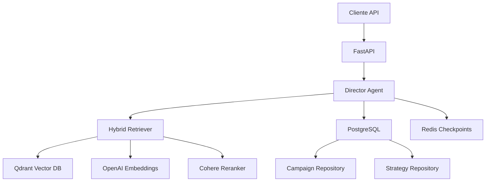

# AgencIA

## 1. Resumen del Proyecto

AgencIA es una **plataforma de agencia de marketing digital operada por agentes de IA**. Permite a los usuarios crear campañas de marketing y recibir estrategias generadas automáticamente por un agente inteligente (Director de Estrategia) que utiliza técnicas avanzadas de RAG (Retrieval-Augmented Generation), frameworks de marketing reconocidos (RACE, SWOT, 4Ps) y un sistema de reflexión iterativa con crítica propia.

**Problema que resuelve:**
Las agencias de marketing tradicionales requieren equipos especializados y tiempo significativo para desarrollar estrategias. AgencIA automatiza la fase estratégica mediante IA, permitiendo generar propuestas de calidad en minutos en lugar de días.

**Estado actual:** En desarrollo activo (v0.1.0). Funcionalidad implementada:
- Sistema RAG completo con ingesta de documentos y búsqueda híbrida
- Agente Director con workflow reflexivo (LangGraph)
- Persistencia híbrida: PostgreSQL (datos estructurados) + Redis (memoria conversacional)
- API REST con endpoints de testing para RAG

---

## 2. Stack Tecnológico

### 2.1 Lenguajes
| Lenguaje | Uso |
|----------|-----|
| Python 3.13 | Lenguaje principal de la aplicación |

### 2.2 Frameworks y Librerías

**Web Framework:**
| Librería | Versión | Propósito |
|----------|---------|-----------|
| FastAPI | >=0.109.0 | Framework web async con validación Pydantic |
| Uvicorn | >=0.27.0 | Servidor ASGI de alto rendimiento |

**IA y Orquestación de Agentes:**
| Librería | Versión | Propósito |
|----------|---------|-----------|
| LangGraph | >=0.2.0 | Orquestación de grafos de estado para agentes |
| LangChain | >=0.3.0 | Framework para aplicaciones con LLMs |
| LangChain-Groq | >=0.2.0 | Integración con Groq para LLMs |
| LangChain-OpenAI | >=0.2.0 | Integración con OpenAI |
| MCP | >=1.0.0 | Model Context Protocol (soporte futuro) |

**RAG y Embeddings:**
| Librería | Versión | Propósito |
|----------|---------|-----------|
| Qdrant Client | >=1.7.0 | Cliente para base de datos vectorial |
| OpenAI | >=1.12.0 | Generación de embeddings densos |
| Sentence Transformers | >=3.0.0 | Embeddings locales para chunking semántico |
| Cohere | >=4.45.0 | Re-ranking de documentos recuperados |
| Rank-BM25 | >=0.2.2 | Búsqueda BM25 (sparse retrieval) |
| NLTK | >=3.8.1 | Tokenización y procesamiento de texto |
| PyMuPDF | latest | Extracción de texto de PDFs |
| tiktoken | >=0.5.0 | Conteo de tokens para LLMs |

**Base de Datos y Cache:**
| Librería | Versión | Propósito |
|----------|---------|-----------|
| SQLAlchemy [asyncio] | >=2.0.25 | ORM async para PostgreSQL |
| asyncpg | >=0.29.0 | Driver async para PostgreSQL |
| Alembic | >=1.13.0 | Migraciones de base de datos |
| Redis (redis-py) | >=5.0.1 | Cache y checkpoints de LangGraph |
| aio-pika | >=9.3.0 | Cliente async para RabbitMQ |

**Procesamiento de Documentos:**
| Librería | Versión | Propósito |
|----------|---------|-----------|
| pypdf | >=4.0.0 | Lectura de archivos PDF |
| python-docx | >=1.1.0 | Lectura de archivos Word |
| BeautifulSoup4 | >=4.12.0 | Parsing de HTML |
| lxml | >=5.1.0 | Parsing XML/HTML avanzado |

### 2.3 Base de Datos

| BD | Uso |
|----|-----|
| **PostgreSQL 18.1** | Datos estructurados: usuarios, campañas, estrategias |
| **Qdrant** | Base de datos vectorial principal para RAG |
| **Redis 8.4** | Cache, sesiones y checkpoints de LangGraph |
| **Redis Stack (Vector)** | Vector store auxiliar (configurado, uso secundario) |
| **RabbitMQ 4.2** | Cola de mensajes (configurado, uso futuro) |

### 2.4 Herramientas de Desarrollo
| Herramienta | Propósito |
|-------------|-----------|
| Docker / Docker Compose | Contenedorización y orquestación de servicios |
| pytest + pytest-asyncio | Testing unitario y de integración |
| debugpy | Debugging remoto (puerto 5678) |
| structlog | Logging estructurado |
| python-dotenv | Gestión de variables de entorno |

---

## 3. Arquitectura

### 3.1 Patrón Arquitectónico Utilizado

El sistema sigue una arquitectura **hexagonal (Ports & Adapters)** con elementos de **Multi-Agent System**:

```
┌─────────────────────────────────────────────────────────────────────┐
│                         CAPA DE PRESENTACIÓN                        │
│                        FastAPI REST API                              │
│                    (app/api/routes/)                                  │
└─────────────────────────┬───────────────────────────────────────────┘
                          │
┌─────────────────────────▼───────────────────────────────────────────┐
│                       CAPA DE APLICACIÓN                            │
│  ┌──────────────┐  ┌──────────────┐  ┌──────────────┐              │
│  │ Agent Director│  │  RAG System  │  │   Schemas    │              │
│  │  (LangGraph) │  │  (Retriever) │  │ (Pydantic)   │              │
│  └──────────────┘  └──────────────┘  └──────────────┘              │
└─────────────────────────┬───────────────────────────────────────────┘
                          │
┌─────────────────────────▼───────────────────────────────────────────┐
│                      CAPA DE DOMINIO                                │
│  ┌──────────────┐  ┌──────────────┐  ┌──────────────┐              │
│  │  DB Models   │  │ Repositories │  │    Core      │              │
│  │ (SQLAlchemy) │  │   (CRUD)     │  │ (Config,etc) │              │
│  └──────────────┘  └──────────────┘  └──────────────┘              │
└─────────────────────────┬───────────────────────────────────────────┘
                          │
┌─────────────────────────▼───────────────────────────────────────────┐
│                       CAPA DE INFRAESTRUCTURA                       │
│  ┌──────────┐ ┌──────────┐ ┌──────────┐ ┌──────────┐              │
│  │PostgreSQL│ │  Qdrant  │ │  Redis   │ │ RabbitMQ │              │
│  └──────────┘ └──────────┘ └──────────┘ └──────────┘              │
└─────────────────────────────────────────────────────────────────────┘
```

### 3.2 Componentes Principales



### 3.3 Flujos de Datos Principales

**Flujo de Estrategia (Ciclo de vida del Director):**

```
1. Cliente → POST /api/test/test-director-hybrid?user_id=X
2. FastAPI → Obtiene campaña de PostgreSQL
3. DirectorAgent.process_campaign()
   │
   ├─→ analyze_brief: LLM analiza el brief del cliente
   │
   ├─→ research_execution: Ejecuta herramientas (RAG + Web Search)
   │     ├─ search_knowledge_base: Busca en Qdrant (RAG interno)
   │     └─ market_intelligence: Combina RAG + Tavily API
   │
   ├─→ draft_strategy: Genera estrategia inicial (framework RACE)
   │
   ├─→ critique_strategy: "Abogado del Diablo" critica la estrategia
   │     │
   │     ├─ Si necesita mejora → refine_strategy → critique_strategy (loop, máx 2)
   │     └─ Si está aprobada → decompose_tasks
   │
   └─→ decompose_tasks: Descompone en tareas asignables
        └─→ Persiste estrategia en PostgreSQL
```

**Flujo de RAG (Búsqueda Híbrida):**

```
Query del usuario
    │
    ▼
QueryDecomposer (LLM Groq)
    │ Descompone en sub-consultas + filtros
    ▼
Para cada sub-consulta:
    │
    ├─→ EmbeddingService (OpenAI text-embedding-3-large) → Vector Denso (3072 dims)
    └─→ SparseEmbedder (BM25 custom) → Vector Disperso
    │
    ▼
Qdrant Hybrid Search
    │ Prefetch sparse + Query dense + Filtros
    ▼
Resultados iniciales
    │
    ▼
CohereReranker (rerank-multilingual-v3.0)
    │ Re-ordena por relevancia
    ▼
Top-K resultados finales
```

---

## 4. Estructura del Proyecto

```
agencIA/
├── .env.example              # Plantilla de variables de entorno
├── .gitignore                # Archivos ignorados por Git
├── Dockerfile                # Build de la imagen Python
├── docker-compose.yml        # Orquestación de todos los servicios
├── requirements.txt          # Dependencias de Python
├── README.md                 # (Vacío)
│
├── app/                      # Código fuente principal
│   ├── main.py               # Punto de entrada FastAPI + lifespan
│   │
│   ├── core/                 # Configuración y servicios centrales
│   │   ├── config.py         # Settings con Pydantic (singleton)
│   │   ├── memory.py         # CheckpointSaver para LangGraph + Redis
│   │   ├── exceptions.py     # (Vacío - por implementar)
│   │   ├── logging.py        # (Vacío - por implementar)
│   │   └── security.py       # (Vacío - por implementar)
│   │
│   ├── agents/               # Sistema Multi-Agente
│   │   ├── base.py           # (Vacío - por implementar)
│   │   ├── registry.py       # (Vacío - por implementar)
│   │   ├── orchestrator_mcp.py # (Vacío - por implementar)
│   │   └── director/         # Agente Director de Estrategia
│   │       ├── agent.py      # Controlador principal (DirectorAgent)
│   │       ├── graph.py      # Grafo LangGraph (workflow reflexivo)
│   │       ├── prompts.py    # Prompts del CSO (System 2 Thinking)
│   │       ├── state.py      # Estado TypedDict + Enum de fases
│   │       └── tools.py      # Herramientas: RAG + Tavily + Benchmarks
│   │
│   ├── api/                  # Capa de presentación REST
│   │   ├── routes/
│   │   │   ├── __init__.py   # Exporta test_router
│   │   │   └── test_routes.py # Endpoints de testing RAG
│   │   └── models/
│   │       └── ingest_models.py # Schemas Pydantic para ingesta
│   │
│   ├── db/                   # Capa de persistencia
│   │   ├── base.py           # Clase base SQLAlchemy (AsyncAttrs)
│   │   ├── session.py        # (Posible session helper)
│   │   ├── dependencies.py   # Dependency injection para FastAPI
│   │   ├── models/
│   │   │   ├── user.py       # Modelo User
│   │   │   ├── campaign.py   # Modelo Campaign (con business logic)
│   │   │   ├── strategy.py   # Modelo Strategy (versionado)
│   │   │   ├── industry.py   # Modelo Industry
│   │   │   ├── document_type.py # Tipo de documento ID
│   │   │   └── politic_division.py # División política (geografía)
│   │   └── repositories/
│   │       ├── base.py       # BaseRepository con retry logic
│   │       ├── campaign_repo.py # CRUD completo de campañas
│   │       └── strategy_repo.py # Gestión de versiones de estrategias
│   │
│   ├── infrastructure/       # Adaptadores externos
│   │   ├── postgres/
│   │   │   └── database.py   # Motor async + SessionLocal + get_db_session
│   │   ├── redis/
│   │   │   └── client.py     # Clientes Redis (principal + vector)
│   │   ├── rabbitmq_cliente/
│   │   │   └── connection.py # Conexión aio-pika (QoS prefetch=10)
│   │   └── qdrant/
│   │       ├── client.py     # AsyncQdrantClient singleton
│   │       └── marketing_vocab.json # Vocabulario BM25 de marketing
│   │
│   ├── rag/                  # Sistema RAG (Retrieval-Augmented Generation)
│   │   ├── embeddings.py     # EmbeddingService (OpenAI)
│   │   ├── sparse_embedder.py # BM25 Sparse Embedder (bilingüe)
│   │   ├── knowledge_base.py # KnowledgeBase + SemanticChunker
│   │   └── retriever.py      # HybridRetriever (decomposition + hybrid + rerank)
│   │
│   ├── schemas/              # Schemas Pydantic para validación
│   │   ├── campaign.py       # CampaignCreate, Update, InDB, WithRelations
│   │   └── strategy.py       # StrategyCreate, Update, InDB, WithDetails
│   │
│   └── scripts/              # Scripts de utilidad
│       └── tests/
│           ├── test_ingest_documents.py # Ingesta de documentos al RAG
│           ├── test_rag_advanced.py # Tests avanzados de RAG
│           ├── test_director_hybrid.py # Test del agente Director
│           ├── test_director_phd.py # Variante PhD del Director
│           ├── debug_qdrant.py # Debug de Qdrant
│           ├── debug_retrieval.py # Debug de retrieval
│           └── ejemplo_uso.py # Ejemplos de uso
│
├── docker/                   # Configuraciones Docker
│   └── rabbitmq/
│       ├── rabbitmq.conf     # Configuración RabbitMQ
│       └── definitions.json  # Usuarios y vhosts predefinidos
│
├── rabbitmq/                 # Configuración RabbitMQ (raíz)
│   ├── rabbitmq.conf
│   └── definitions.json
│
└── doc/                      # Documentos para ingestar al RAG
    ├── framework/            # Frameworks de marketing
    ├── teoria/               # Teorías y conceptos
    ├── reporte/              # Reportes de industria
    ├── caso_estudio/         # Casos de estudio
    └── planteamiento_agencIA.txt # Documento del planteamiento del proyecto
```

---

## 5. Configuración

### 5.1 Variables de Entorno

Ver `.env.example` para referencia completa. Secciones principales:

```bash
# ============ Aplicación ============
APP_ENV=development       # development | staging | production
APP_DEBUG=true
APP_HOST=0.0.0.0
APP_PORT=8000

# ============ API Keys ============
GROQ_API_KEY=             # Para LLMs (Llama 3.3)
OPENAI_API_KEY=           # Para embeddings (text-embedding-3-large)
COHERE_API_KEY=           # Para re-ranking (opcional)
TAVILY_API_KEY=           # Para búsqueda web (opcional)

# ============ PostgreSQL ============
POSTGRES_USER=agencia
POSTGRES_PASSWORD=agencia_secret
POSTGRES_DB=agencia_db
POSTGRES_HOST=localhost
POSTGRES_PORT=5432

# ============ Redis ============
REDIS_HOST=localhost
REDIS_PORT=6379
REDIS_PASSWORD=redis_secret

# ============ RabbitMQ ============
RABBITMQ_HOST=localhost
RABBITMQ_PORT=5672
RABBITMQ_USER=agencia
RABBITMQ_PASSWORD=rabbitmq_secret

# ============ Qdrant ============
QDRANT_HOST=localhost
QDRANT_PORT=6333

# ============ Embeddings ============
EMBEDDING_MODEL=text-embedding-3-large
EMBEDDING_DIMENSION=3072

# ============ LLM ============
LLM_MODEL=llama-3.3-70b-versatile
LLM_TEMPERATURE=0.7
```

### 5.2 Instalación y Setup

**Requisitos previos:**
- Docker y Docker Compose
- Python 3.13+
- API Keys: Groq (obligatorio), OpenAI (obligatorio), Cohere (opcional), Tavily (opcional)

**Opción 1: Docker Complete (Recomendado)**

```bash
# 1. Clonar el repositorio
git clone <repo-url> && cd agencIA

# 2. Copiar y configurar variables de entorno
cp .env.example .env
# Editar .env con tus API keys

# 3. Iniciar todos los servicios
docker compose up --build

# La API estará disponible en http://localhost:8000
# Docs Swagger: http://localhost:8000/docs
```

**Opción 2: Desarrollo Local**

```bash
# 1. Crear entorno virtual
python -m venv venv
source venv/bin/activate  # Linux/Mac
# venv\Scripts\activate   # Windows

# 2. Instalar dependencias
pip install -r requirements.txt

# 3. Iniciar solo los servicios (sin la API)
docker compose up postgres redis redis_vector qdrant rabbitmq

# 4. Iniciar la API localmente
uvicorn app.main:app --host 0.0.0.0 --port 8000 --reload

# 5. Debug mode (con debugpy en puerto 5678)
# Configurar APP_DEBUG=true en .env
# Conectar IDE al puerto 5678
```

**Configuración optimizada de PostgreSQL (en docker-compose):**
- shared_buffers=3GB
- work_mem=16MB
- max_connections=200
- WAL optimizations para rendimiento

---

## 6. Componentes Principales

### 6.1 Core (`app/core/`)

#### `config.py` - Configuración Central
- **Clase:** `Settings` (Pydantic BaseSettings)
- **Patrón:** Singleton con `@lru_cache`
- **Acceso:** `from app.core.config import settings`
- **Funcionalidades:**
  - Carga automática desde `.env`
  - Campos computados (`@computed_field`) para URLs de conexión
  - Tipado estricto con `Literal` para entornos

#### `memory.py` - Gestión de Memoria (LangGraph + Redis)
- **Clase:** `AsyncRedisCheckpointSaver`
- **Propósito:** Persistencia de checkpoints de LangGraph en Redis
- **Características:**
  - Namespacing por agente (ej: `"director"`)
  - TTL configurable (checkpoints: 7 días, sesiones: 24 horas)
  - Pipeline Redis para atomicidad
  - Clave de formato: `agencia:{namespace}:thread:{thread_id}:checkpoint:{id}`
- **Clase:** `MemoryService` - Singleton para gestión centralizada

### 6.2 Agents (`app/agents/`)

#### `director/agent.py` - Agente Director
- **Clase:** `DirectorAgent`
- **Patrón:** Singleton
- **Método principal:** `process_campaign(campaign_id, db_session)`
- **Flujo:**
  1. Valida ID y sesión de DB
  2. Carga contexto desde PostgreSQL (CampaignRepository)
  3. Configura checkpointer Redis con namespace `"director"`
  4. Ejecuta grafo LangGraph con `astream()` (streaming)
  5. Intercepta eventos y persiste estrategias en DB

#### `director/graph.py` - Grafo LangGraph
- **Nodos (fases del workflow):**
  1. `analyze_brief` - Diagnóstico inicial del brief
  2. `research_execution` - Investigación con herramientas
  3. `draft_strategy` - Generación de borrador (framework RACE)
  4. `critique_strategy` - Crítica ("Abogado del Diablo")
  5. `refine_strategy` - Refinamiento basado en crítica
  6. `decompose_tasks` - Descomposición en tareas operativas

- **Edges condicionales:**
  - `research_execution` → `tools` (si hay tool_calls) o `draft_strategy`
  - `critique_strategy` → `decompose_tasks` (aprobado) o `refine_strategy` (necesita mejora)
  - Máximo 2 iteraciones de refinamiento

#### `director/prompts.py` - Prompts Especializados
- **System Prompt:** Persona de Chief Strategy Officer con 20 años de experiencia
- **Principios:** Skepticism First, Framework Driven, Data over Opinion, Iterative Excellence
- **Prompts por fase:** ANALYZE_BRIEF, DRAFT_STRATEGY, CRITIQUE_STRATEGY, DECOMPOSE_TASKS

#### `director/state.py` - Estado del Agente
- **TypedDict:** `DirectorState` con campos:
  - `messages`: Historial conversacional (acumulativo)
  - `client_brief`: Datos del brief
  - `research_data`: Contexto RAG
  - `current_strategy`: Estrategia en desarrollo
  - `strategy_versions`: Historial de versiones
  - `tasks`: Tareas descompuestas
  - `current_phase`, `iteration_count`: Control de flujo

- **Enums:** `AgentPhase` (INITIAL → ANALYZING_BRIEF → ... → COMPLETED)
- **Dataclasses:** `StrategyVersion`, `ReviewComment`

#### `director/tools.py` - Herramientas del Director
1. **`search_knowledge_base`**: Búsqueda en RAG interno (Qdrant híbrido)
2. **`market_intelligence`**: Combina RAG interno + Tavily API (web search)
3. **`get_channel_benchmarks`**: Benchmarks estáticos de canales (Facebook, Instagram, etc.)

### 6.3 RAG System (`app/rag/`)

#### `embeddings.py` - Servicio de Embeddings
- **Clase:** `EmbeddingService`
- **Proveedor:** OpenAI `text-embedding-3-large`
- **Dimensión:** 3072
- **Método:** `embed_text_dense(text)`

#### `sparse_embedder.py` - Embeddings Dispersos (BM25)
- **Clase:** `SparseEmbedder`
- **Características:**
  - Vocabulario persistente desde `marketing_vocab.json`
  - Stopwords bilingües (español + inglés)
  - Parámetros BM25: k1=1.2, b=0.75
- **Método:** `generate_sparse_embedding(text)` → `SparseVector`

#### `knowledge_base.py` - Base de Conocimiento
- **Clase:** `KnowledgeBase`
- **Funcionalidades:**
  - `initialize()`: Crea colección Qdrant con vectores densos + sparse
  - `extract_text()`: Extrae texto de PDFs con PyMuDF
  - `add_document()`: Chunking semántico + embedding + upsert
  - `search_hybrid()`: Búsqueda híbrida (dense + sparse + filtros)
  - `get_stats()`: Estadísticas de la colección

- **Clase:** `SemanticChunker`
  - Chunking basado en similitud coseno entre oraciones
  - Umbral dinámico (percentil 5)
  - Límite de 900 palabras por chunk

#### `retriever.py` - Retriever Híbrido Avanzado
- **Clase:** `HybridRetriever`
- **Pipeline:**
  1. `QueryDecomposer` (LLM Groq): Descompone query compleja en sub-consultas con filtros
  2. Para cada sub-consulta:
     - Genera embedding denso (OpenAI)
     - Genera embedding sparse (BM25)
     - Búsqueda en Qdrant con filtros
  3. Deduplicación y fusión de resultados
  4. `CohereReranker`: Re-ordena con modelo `rerank-multilingual-v3.0`

- **Fallback strategy:** Si no hay resultados con filtros, reintenta sin filtros

### 6.4 Database (`app/db/`)

#### Modelos (SQLAlchemy 2.0 + Mapped)

**User** (`users`)
- Campos: nombre, apellido, documento, email, teléfono, dirección, redes sociales
- Relaciones: campaigns, politic_division, industry, document_type

**Campaign** (`campaigns`)
- Estado: P(planificación) → A(activa) → C(completada) / S(pausada) / X(cancelada)
- Prioridad: 1(baja) → 4(urgente)
- JSONB fields: `camp_brief_data`, `camp_dipo_ids`, `camp_tags`
- Business logic integrada: `start()`, `complete()`, `pause()`, `cancel()`, `approve()`
- Propiedades calculadas: `remaining_budget`, `budget_utilization`, `days_remaining`

**Strategy** (`strategies`)
- Versionado: `stra_version` incrementa por campaña
- Estados: D(borrador) → P(en revisión) → A(aprobada) / R(rechazada) / C(cancelada)
- JSONB field: `stra_content` (contenido generado por IA)
- Tracking IA: `ai_agent_id`, `ai_model`, `ai_temperature`, `ai_tokens_used`
- Scores: `stra_quality_score`, `stra_feasibility_score`, `stra_roi_estimate`
- Change log: `stra_change_log` (JSONB array)

**Industry** (`industries`)
- Campos: nombre, sector, descripción

#### Repositories

**BaseRepository**
- `execute_with_retry()`: Reintentos con backoff exponencial para IntegrityError

**CampaignRepository**
- CRUD completo: create, get_by_id, get_by_code, get_all_by_user, search (multi-filtro)
- Business operations: start, complete, pause, resume, cancel, approve
- Estadísticas: count_by_status, get_campaign_stats, get_campaigns_over_budget, get_campaigns_near_deadline
- Tags: add_tag, remove_tag, get_all_tags

**StrategyRepository**
- `save_strategy_version()`: Crea nueva versión incrementando contador
- `get_latest_strategy_by_campaign()`: Obtiene versión más reciente

### 6.5 Infrastructure (`app/infrastructure/`)

| Módulo | Cliente | Configuración |
|--------|---------|---------------|
| `postgres/database.py` | `AsyncSession` via SQLAlchemy | pool_size=20, max_overflow=10, pool_pre_ping |
| `redis/client.py` | `redis.asyncio.Redis` | 2 instancias: cache + vector |
| `rabbitmq_cliente/connection.py` | `aio_pika` | prefetch_count=10 |
| `qdrant/client.py` | `AsyncQdrantClient` | API key opcional |

### 6.6 API (`app/api/`)

#### Endpoints Disponibles

| Método | Ruta | Descripción |
|--------|------|-------------|
| GET | `/` | Health check básico |
| POST | `/api/test/ingest-document` | Ingestar documento individual al RAG |
| POST | `/api/test/ingest-directory` | Ingesta masiva de carpeta |
| GET | `/api/test/validate-ingestion/{file_name}` | Validar calidad de ingesta |
| GET | `/api/test/collection-stats` | Estadísticas de colección Qdrant |
| GET | `/api/test/inspect-chunks` | Preview de chunking sin ingestar |
| GET | `/api/test/test-rag-advanced` | Test avanzado de RAG |
| GET | `/api/test/test-director-hybrid?user_id=X` | Test del agente Director |

#### Schemas Pydantic

**DocumentIngestRequest**
- Campos: `file_path`, `category` (Framework|Teoría|Reporte|Caso de Estudio), `source_author`, `year`, `is_evergreen`, `topic_tags`, `industry_sector`
- Validadores: verifica existencia de archivo, normaliza categoría

**DocumentIngestResponse / BatchIngestResponse**
- Campos: `success`, `message`, `chunks_added`, `metadata`, `collection_stats`

---

## 7. API Endpoints

### 7.1 Endpoints de Testing RAG

#### POST `/api/test/ingest-document`
Ingesta un documento individual al sistema RAG.

**Request Body:**
```json
{
  "file_path": "doc/framework/race_framework.pdf",
  "category": "Framework",
  "source_author": "Autor Original",
  "year": 2024,
  "is_evergreen": true,
  "topic_tags": ["marketing", "digital", "race"],
  "industry_sector": "General"
}
```

**Response:**
```json
{
  "success": true,
  "message": "Documento ingresado exitosamente: 15 chunks añadidos",
  "file_path": "/path/to/file.pdf",
  "chunks_added": 15,
  "metadata": {...},
  "collection_stats": {
    "vectors_count": 150,
    "points_count": 150
  }
}
```

#### POST `/api/test/ingest-directory`
Ingesta masiva de todos los documentos en una carpeta.

**Parameters (query):**
- `directory_path`: Ruta al directorio
- `source_author`: Autor por defecto
- `year`: Año de los documentos
- `is_evergreen`: Si es conocimiento permanente
- `topic_tags`: Tags por defecto
- `industry_sector`: Sector industrial

#### GET `/api/test/inspect-chunks/{file_path}`
Analiza cómo se dividiría un documento sin ingestarlo (sin costo de API).

**Response:**
```json
{
  "file": "race_framework.pdf",
  "total_words": 3500,
  "num_chunks": 8,
  "avg_words_per_chunk": 437.5,
  "chunks": [
    {
      "chunk_id": 0,
      "word_count": 380,
      "char_count": 2100,
      "preview": "El framework RACE es..."
    }
  ]
}
```

#### GET `/api/test/test-director-hybrid?user_id=X`
Ejecuta el flujo completo del agente Director para una campaña del usuario.

**Response (streaming events):**
```json
{"event": "context_loaded", "campaign": "Campaña Verano", "client": "Juan Pérez"}
{"event": "strategy_persisted", "version": 1, "db_id": "123"}
```

---

## 8. Flujos de Ejecución

### 8.1 Inicio de la Aplicación (Lifespan)

```python
# app/main.py - lifespan()

Startup:
  1. Conectar PostgreSQL (asyncpg pool)
  2. Conectar Redis (cache + vector)
  3. Conectar Qdrant
  4. [RabbitMQ: commented out]
  
  ↓ (app running)

Shutdown:
  1. Desconectar PostgreSQL
  2. Desconectar Redis
  3. Desconectar Qdrant
```

### 8.2 Ingesta de Documentos

```
1. Cliente envía POST /api/test/ingest-document
2. Validate file exists + normalize category
3. KnowledgeBase.extract_text(file_path)
   └─ PyMuDF lee PDF → texto + normalización
4. SemanticChunker.semantic_chunking(text)
   └─ NLTK tokeniza → oraciones → similitud coseno → chunks
5. Para cada chunk:
   ├─ EmbeddingService.embed_text_dense(chunk) → vector 3072d
   ├─ SparseEmbedder.generate_sparse_embedding(chunk) → sparse vector
   └─ PointStruct con payload (content, metadata, document_id)
6. Qdrant.upsert(points)
7. Retorna estadísticas
```

### 8.3 Proceso del Director (Ciclo Reflexivo)

```
1. DirectorAgent.process_campaign(campaign_id, db_session)
   │
   ├─ CampaignRepository.get_by_id(campaign_id)
   │  └─ Retorna Campaign con user y brief_data
   │
   ├─ MemoryService.get_checkpointer(namespace="director")
   │  └─ Configura Redis con TTL 7 días
   │
   ├─ create_initial_state(session_id, client_id, brief)
   │
   └─ graph.astream(initial_state, config, checkpointer)
      │
      ├── Phase 1: analyze_brief
      │   └─ LLM analiza → viability_score, core_problem, research_topics
      │
      ├── Phase 2: research_execution
      │   ├─ [Condición] ¿Necesita tools? → execute tool_node
      │   │   ├─ search_knowledge_base(query) → Qdrant hybrid search
      │   │   ├─ market_intelligence(industry, region) → RAG + Tavily
      │   │   └─ get_channel_benchmarks(channel, metric)
      │   └─ [Condición] ¿Investigación completa? → draft_strategy
      │
      ├── Phase 3: draft_strategy
      │   └─ LLM genera estrategia con framework RACE
      │      └─ Persiste StrategyVersion en memoria
      │
      ├── Phase 4: critique_strategy (loop hasta 2 iteraciones)
      │   └─ "Abogado del Diablo" critica
      │      ├─ ¿Aprobado? → decompose_tasks
      │      └─ ¿Necesita mejora? → refine_strategy → critique_strategy
      │
      └── Phase 5: decompose_tasks
          └─ LLM genera tareas atómicas
             └─ Evento "strategy_persisted" → StrategyRepository.save_strategy_version()
```

### 8.4 Pipeline de RAG (HybridRetriever.retrieve)

```
1. QueryDecomposer.decompose(query)
   └─ LLM Groq descompone en sub-consultas + filtros
   
2. Para cada sub-consulta:
   a. embed_text_dense(query) → OpenAI (3072d)
   b. generate_sparse_embedding(query) → BM25 sparse vector
   c. _build_qdrant_filter(filters_dict) → Qdrant Filter
   
3. Qdrant.query_points()
   ├─ Prefetch: sparse vector (keywords)
   ├─ Query: dense vector (semantic)
   ├─ Filtros de metadatos
   └─ score_threshold=0.4
   
4. [Fallback] Si resultados vacíos + filtros activos → reintenta sin filtros

5. Deduplicación por document_id, mantener máximo score

6. CohereReranker.rerank(query, results, top_n=10)
   └─ Re-ordena con rerank-multilingual-v3.0
   
7. Retorna List[RetrievalResult]
```

---

## 9. Consideraciones Técnicas

### 9.1 Patrones de Diseño Utilizados

| Patrón | Aplicación |
|--------|------------|
| **Singleton** | Settings, MemoryService, KnowledgeBase, HybridRetriever |
| **Repository** | CampaignRepository, StrategyRepository con BaseRepository |
| **Dependency Injection** | `get_db_session()` en FastAPI, `Depends(get_db_session)` |
| **Strategy** | Tools del Director (cada tool es un @tool decorado) |
| **State Pattern** | DirectorState con AgentPhase enum |
| **Pipeline** | RAG retriever (decomposition → hybrid search → reranking) |
| **Checkpoint** | AsyncRedisCheckpointSaver para LangGraph |
| **Async Context Manager** | `lifespan()` de FastAPI, `pipeline()` de Redis |

### 9.2 Convenciones de Código

- **Async everywhere:** Todas las operaciones de I/O son async (DB, Redis, Qdrant, LLMs)
- **Pydantic v2:** Validación de schemas, `model_dump()`, `field_validator`
- **SQLAlchemy 2.0:** `Mapped` + `mapped_column` para modelos tipados
- **Type hints completos:** Python 3.13 con union types (`str | int`)
- **Singleton pattern:** Variables `_xxx` con funciones `get_xxx()` 
- **Docstrings:** Documentación en español, formato Google style
- **Enum classes:** `str`/`int` enums para estados y prioridades
- **JSONB en PostgreSQL:** Para campos flexibles (brief_data, tags, content)

### 9.3 Manejo de Errores

- **Repository retry:** `execute_with_retry()` con backoff exponencial para IntegrityError
- **HTTP Exceptions:** FastAPI HTTPException con status codes apropiados
- **Fallback en RAG:** Si búsqueda con filtros falla, reintenta sin filtros
- **Fallback en Reranking:** Si Cohere falla, devuelve resultados ordenados por score original
- **Validación Pydantic:** `@field_validator` para validación custom (archivos, categorías)
- **Constraints SQL:** CHECK constraints en modelos (rangos, estados, fechas lógicas)

---

## 10. Pruebas

### 10.1 Framework de Testing

- **pytest** con plugins:
  - `pytest-asyncio`: Tests async
  - `pytest-cov`: Cobertura de código

### 10.2 Ejecución de Tests

```bash
# Ejecutar todos los tests
pytest

# Con cobertura
pytest --cov=app --cov-report=html

# Tests específicos
pytest app/scripts/tests/test_rag_advanced.py
pytest app/scripts/tests/test_director_hybrid.py
```

### 10.3 Tests Disponibles

| Test | Descripción |
|------|-------------|
| `test_rag_advanced.py` | Tests del pipeline RAG completo |
| `test_director_hybrid.py` | Tests del agente Director con DB |
| `test_director_phd.py` | Variante PhD del Director |
| `test_ingest_documents.py` | Ingesta de documentos al RAG |

### 10.4 Tests via API

Los tests también están expuestos como endpoints REST para testing manual:

```bash
# Test RAG avanzado
curl http://localhost:8000/api/test/test-rag-advanced

# Test Director (requiere usuario existente)
curl "http://localhost:8000/api/test/test-director-hybrid?user_id=1"

# Inspeccionar chunks de un documento
curl "http://localhost:8000/api/test/inspect-chunks?file_path=doc/framework/race.pdf"
```

---

## Anexos

### A. Configuración de Modelos LLM

| Modelo | Proveedor | Uso | Temperatura |
|--------|-----------|-----|-------------|
| `openai/gpt-oss-120b` | Groq | Director (principal) | 0.2 |
| `openai/gpt-oss-20b` | Groq | Query Decomposer (secundario) | 0.0 |
| `text-embedding-3-large` | OpenAI | Embeddings densos | N/A |
| `rerank-multilingual-v3.0` | Cohere | Re-ranking | N/A |
| `all-MiniLM-L6-v2` | Sentence Transformers | Chunking semántico | N/A |

### B. Estructura de la Colección Qdrant

```
Colección: agencia_knowledge_base

Vectores:
  - semantic: 3072 dimensiones, COSINE distance
  - keywords: SparseVector (BM25)

Payload por punto:
  - content: string (texto del chunk)
  - category: string (Framework|Teoría|Reporte|Caso de Estudio)
  - source_author: string
  - year: int
  - is_evergreen: bool
  - topic_tags: list[string]
  - industry_sector: string
  - original_document: string (nombre archivo)
  - document_id: string (UUID)
  - chunk_id: int
```

### C. Puerto y URLs de Servicios

| Servicio | Puerto | URL |
|----------|--------|-----|
| AgencIA API | 8000 | http://localhost:8000 |
| Swagger Docs | 8000 | http://localhost:8000/docs |
| Debugpy | 5678 | vscode://debugpy |
| PostgreSQL | 5432 | postgresql://localhost:5432 |
| Redis | 6379 | redis://localhost:6379 |
| Redis Vector | 6380 | redis://localhost:6380 |
| RabbitMQ | 5672 | amqp://localhost:5672 |
| RabbitMQ Management | 15672 | http://localhost:15672 |
| Qdrant REST | 6333 | http://localhost:6333 |
| Qdrant gRPC | 6334 | grpc://localhost:6334 |
